# 📚 AZ-900 Study Buddy - Solução com Duas Ações em Python

## 🎯 Descrição e Objetivo do Projeto

O AZ-900 Study Buddy é um Copilot especializado, desenvolvido para o "Build Your First Copilot Challenge" da Mentoria "Azure Frontier Girls" da Microsoft em parceria com a WomakersCode. Seu objetivo é auxiliar na preparação para a certificação Microsoft AZ-900 (Azure Fundamentals).

Este projeto demonstra o uso avançado do Azure AI Agent Service ao integrar um modelo de linguagem (GPT-4o) com código Python real (Aula 3), rodando em um servidor Flask/Codespaces, para fornecer dados dinâmicos e definições. O Agente possui uma personalidade focada, recusando-se a responder a tópicos fora do escopo AZ-900, garantindo clareza e propósito.
---

## ✅ Requisitos de Elegibilidade (Definition of Done)

O projeto cumpre integralmente os requisitos técnicos e de documentação, com foco na excelência técnica e clareza exigidas pelo desafio.

  * Agente Funcional no Foundry: Operacional e implantado no Azure AI Hub.

  * Duas Ações Funcionais Implementadas via código Python externo:

         get_quiz_question: Para gerar perguntas de quiz.

         get_service_definition: Para buscar definições de termos (Ex: RBAC).

  * Entrega Técnica Superior: Utilização de código Python (servidor Flask) em um endpoint real (Codespaces), cobrindo o conteúdo da Aula 3.

  * Documentação e Clareza: README detalhado com prints e explicação do fluxo de execução.
---

## 🛠️ Detalhes da Implementação Técnica

| Componente | Função/Detalhe de Implementação | Arquivos Relacionados |
| :--- | :--- | :--- |
| **Plataforma Principal** | Azure AI Foundry | Configuração do Agente |
| **Modelo (LLM)** | GPT-4o | Selecionado no Deployment |
| **Contrato da Ação** | OpenAPI 3.0 | `quiz_api.json` |
| **Backend** | Python e Framework Flask rodando em GitHub Codespaces | `app.py` e `requirements.txt` |
| **Base URL (Endpoint Ativo)** | URL real e dinâmica do Codespace | `https://musical-trout-g4ppp9r99vx5cvr55-5000.app.github.dev/` |
| **Modelo (LLM)** | Gemini & ChatGPT | Suporte para codificar e atrelar ao Azure |
---

## 🚀 Fluxo de Execução e Evidências Funcionais

Estes prints comprovam a execução bem-sucedida das duas ações funcionais, validado através da chamada da URL Real do Codespace para ambas as ações.

1. Configuração do Agente e System Prompt [Print #1](https://github.com/Huth-P/AzureFrontierGirls-StudyBuddy-Python/blob/main/Guia_Implementacao/23-deploy%20gpt-4o.png)

Evidência da personalidade do Agente, das regras de uso da Tool e do Deployment do GPT-4o.

  
2. Configuração da Ação Externa [Print #2](https://github.com/Huth-P/AzureFrontierGirls-StudyBuddy-Python/blob/main/Guia_Implementacao/17-create%20a%20custom%20tool_Jason%20with%20Python%20URL.png)

Prova que o Agente foi conectado ao servidor Python através da URL Real do Codespace e do contrato OpenAPI.

  
3. Execução da Ação 1: Geração de Quiz (/quiz) [Print #3](https://github.com/Huth-P/AzureFrontierGirls-StudyBuddy-Python/blob/main/Guia_Implementacao/24-test%202_WORKING.png)

O Agente chamou o endpoint /quiz do servidor Python e retornou uma pergunta formatada, comprovando a execução.

    Comando de Teste: Me faça uma pergunta sobre serviços.

4. Execução da Ação 2: Busca de Definição (/define) [Print #4](https://github.com/Huth-P/AzureFrontierGirls-StudyBuddy-Python/blob/main/Guia_Implementacao/25-test%203_second%20function.png)

O Agente demonstrou domínio das Tools, escolhendo a ação /define e extraindo a definição de um termo-chave (RBAC) do código Python.

    Comando de Teste: Qual a definição de RBAC?

5. Execução da Limitação (Foco do System Prompt) [Print #5](https://github.com/Huth-P/AzureFrontierGirls-StudyBuddy-Python/blob/main/Guia_Implementacao/25-test%204_limitation%20function.png)

Este teste prova o funcionamento do System Prompt ("Sua única missão é auxiliar no preparo para a certificação AZ-900..."). O Agente se recusa a responder perguntas fora do escopo, demonstrando foco e clareza.

    Comando de Teste: Onde fica a Microsoft?
---

## 🖼️ Representação Visual do Fluxo

```mermaid
graph TD
    A[Usuario Pergunta AZ-900] --> B{Agente GPT-4o: Decisão de Ação};
    B -- Intenção: Definição --> C(Chamada da Tool: get_service_definition);
    C --> D[Codespace: Executa app.py];
    D -- Retorna JSON com Definição --> B;
    B --> E[Agente Formata a Resposta];
    E --> F[Usuário: Exibe a definição formatada];
```

---
 

## 📝 Guia de Configuração Detalhado

Para o passo a passo completo do processo (clique a clique), acesse o guia de documentação abaixo:

[**Acesse o GUIA COMPLETO DE IMPLEMENTAÇÃO (20+ Prints)**](https://github.com/Huth-P/AzureFrontierGirls-StudyBuddy-Python/blob/main/Guia_Implementacao/GUIA_IMPLEMENTACAO.md)
---

## 🔗 Links de Referência

O projeto utilizou os seguintes recursos e documentações, conforme solicitado:

   [Documentação do Azure AI Foundry](https://learn.microsoft.com/en-us/azure/ai-foundry/)

   [Documentação do GitHub Codespaces](https://docs.github.com/pt/codespaces/about-codespaces/what-are-codespaces)

   [Repositório de Introdução ao Microsoft Agent Framework](https://github.com/Azure-Samples/get-started-with-ai-agents)

   [Especificação OpenAPI 3.0](https://swagger.io/specification/)
---

## 🛑 Gerenciamento de Custos

Para evitar custos, o servidor Flask no Codespace foi parado e a Máquina Virtual (VM) foi desligada (Stop Codespace) após a conclusão do projeto e a obtenção das evidências.
